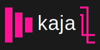
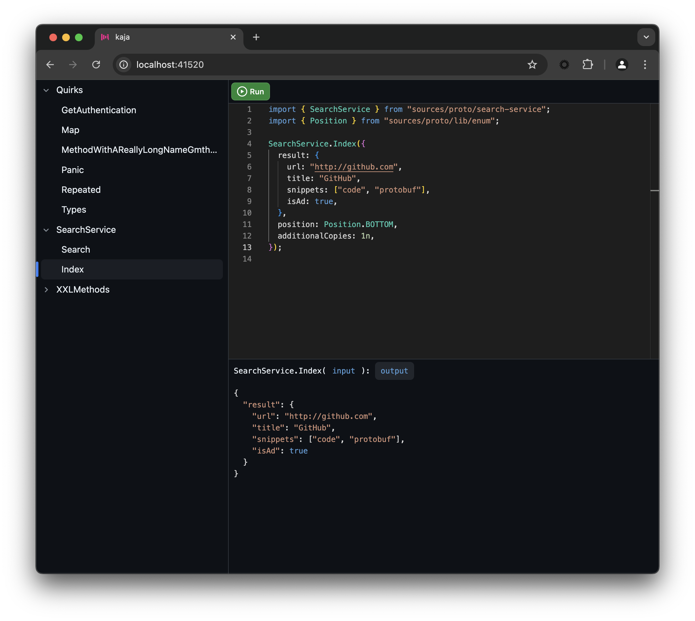

# Introduction

`kaja` is a code-based UI for exploring and calling [Twirp](https://github.com/twitchtv/twirp) APIs. Try [live demo](https://kaja.tools/demo).

Support for gRPC is coming later.



You can embedded `kaja` into your development workflow as a Docker container. Desktop version is coming later.

```
docker run --pull always --name kaja -d -p 41520:41520 \
    -v /my_app/proto:/workspace/proto -e BASE_URL="http://host.docker.internal:8080" \
    --add-host=host.docker.internal:host-gateway kajatools/kaja:latest
```

`docker run` arguments explained:

- `--pull always` - Always pull the latest image from Docker Hub. `kaja` is updated frequently.
- `--name kaja` - Name the container. Useful for managing multiple containers.
- `-d` - Run the container in the [detached mode](https://docs.docker.com/engine/reference/run/#detached--d).
- `-p 41520:41520` - Expose the container's port 41520 on the host's port 41520. `kaja` listens on port 41520 by default.
- `-v /my_app/proto:/workspace/proto` - Mount the `/my_app/proto` directory from the host file system into the container's `/workspace/proto` directory. `kaja` will recursively search for `.proto` files in this directory. `/my_app/proto` should be your application's [--proto_path](https://protobuf.dev/reference/cpp/api-docs/google.protobuf.compiler.command_line_interface/), the directory where your `.proto` files are located.
- `-e BASE_URL="http://host.docker.internal:8080"` - Set the `BASE_URL` environment variable. This is the base URL of the Twirp API. `kaja` will use this URL to when calling the Twirp APIs. See [Configuration](#configuration) for all the available configuration options.
- `--add-host=host.docker.internal:host-gateway` - Expose the host's locahost to the container. This is required for `kaja` to be able to call the Twirp API from inside the container.
- `kajatools/kaja:latest` - `kaja` is available on [Docker Hub](https://hub.docker.com/r/kajatools/kaja).

# Configuration

Configuration can be provided via environment variables or a config file. Use the [-e parameter](https://docs.docker.com/engine/reference/commandline/run/#env) when running the Docker container.

```
docker run -e BASE_URL="http://host.docker.internal:8080" ...
```

List of configuration options:

- `BASE_URL` - The base URL of the Twirp API. Example: `http://host.docker.internal:8080`.

Alternatively, `kaja` will use [dotenv](https://github.com/motdotla/dotenv) to look for a `.env` file in the `/app` directory of the Docker container. You can use the [-v parameter](https://docs.docker.com/engine/reference/commandline/run/#volume) to mount a `.env` file from the host file system. This is useful when
you need to dynamically change the configuration. For example, when an authentication header needs to refreshed.

```
docker run -v /tmp/kaja.env:/app/.env ...
```

# Development

Run: `scripts/run`
Test: `(cd ui && npm test)`
